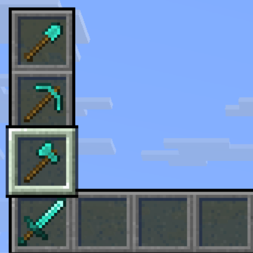
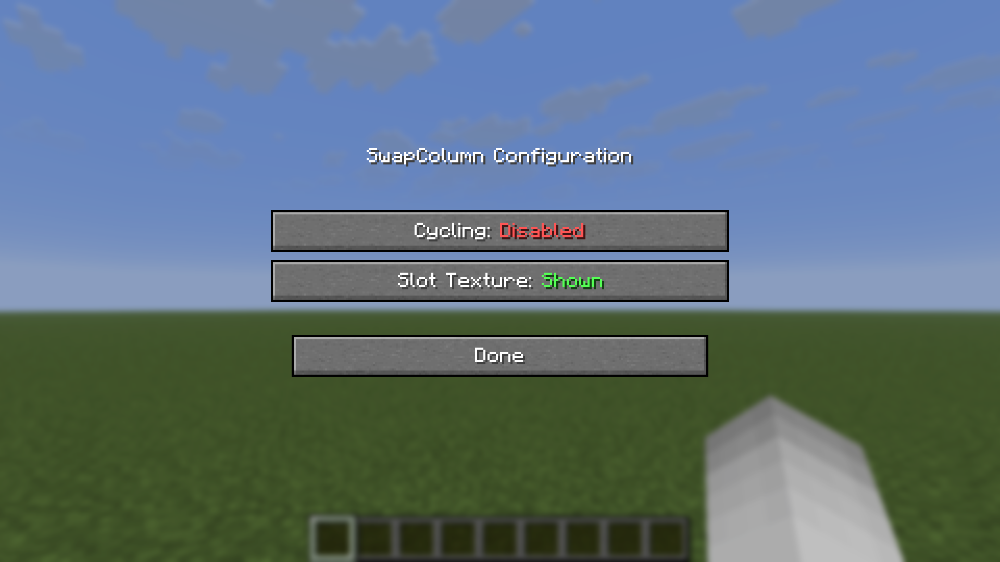

# SwapColumn — 26.1.2 移植版 / Port for 26.1.2

[原模组 Original mod](https://github.com/TAPM04/swapcolumn) 由 [TAPM](https://github.com/TAPM04) 开发，此仓库是将原模组移植到 Minecraft **26.1.2** 的版本。
This is a port of the original mod by [TAPM](https://github.com/TAPM04) to Minecraft **26.1.2**.

---

**中文**

SwapColumn 是一个 Fabric 客户端模组，让你无需打开背包即可将物品在快捷栏和其正上方的三格库存栏位之间快速交换。

**English**

SwapColumn is a Fabric client mod that lets you swap items between your hotbar and the three inventory slots directly above it — without opening your inventory.



---

## 使用方法 / How It Works

### 打开菜单 / Opening the Menu

**模式一 — 数字键 / Mode 1 — Number Key:**
按下当前所在快捷栏位对应的数字键。
Press the number key of the hotbar slot you are *already on*.
示例：你在第 3 格，按下 `3`，SwapColumn 就会在第 3 格上方打开。
Example: you are on slot 3, press `3` — the SwapColumn opens above slot 3.

**模式二 — 自定义按键 / Mode 2 — Keybind:**
按下你设置的 SwapColumn 按键（默认未绑定），在 **选项 → 控制 → SwapColumn** 中设置。
Press your configured SwapColumn key (unbound by default). Set it under **Options → Controls → SwapColumn**.


### 选择物品 / Selecting an Item

**点击模式 / Click mode:**
- 模式一：按 `1`–`4` 选择行（`1` = 当前快捷栏物品，取消交换）
  Mode 1: press `1`–`4` to select a row (`1` = current hotbar item, cancels the swap)
- 模式二：按 `1`–`3` 选择行，再次按 SwapColumn 键取消
  Mode 2: press `1`–`3` to select a row, press the SwapColumn key again to cancel

**滚轮模式 / Scroll mode:**
按住开启键并滚动滚轮高亮某一行，松开确认交换。
Hold the opening key and scroll to highlight a row, then release to confirm.

---

## 配置 / Configuration

配置文件位于 `.minecraft/config/swapcolumn.json`，首次启动时自动生成。
The config file is located at `.minecraft/config/swapcolumn.json` and is created automatically on first launch.

```json
{
  "enableCycling": false,
  "enableSlotTexture": true
}
```

| 选项 Option | 默认 Default | 说明 Description |
|---|---|---|
| `enableCycling` | `false` | 滚动时从顶部/底部循环。注意：首次滚动操作时向下滚动始终会循环，不受此设置影响。When scrolling, wrap around from top to bottom and vice versa. Note: scrolling down on the first action always wraps regardless of this setting. |
| `enableSlotTexture` | `true` | 使用原版快捷栏纹理渲染栏位背景。若纹理包导致显示异常可关闭。Render slot backgrounds using the vanilla hotbar texture. Disable if your texture pack causes visual issues. |

### Mod Menu 支持 / Mod Menu Support

安装了 [Mod Menu](https://modrinth.com/mod/modmenu) 后，可在模组列表中直接切换选项，立即生效。Mod Menu 为可选依赖，未安装时直接编辑配置文件即可（文件修改在下一次启动游戏时生效）。
With [Mod Menu](https://modrinth.com/mod/modmenu) installed, both options can be toggled in-game from the mod list — changes apply immediately. Mod Menu is optional: without it, edit the config file directly (file edits take effect on the next game start).



---

## 兼容性 / Compatibility

- Minecraft: `26.1.2`
- Fabric Loader: `>= 0.19.3`
- Fabric API: 需要 / required
- Java: `>= 25`

---

## 许可证 / License

MIT — 见 [LICENSE](LICENSE).
